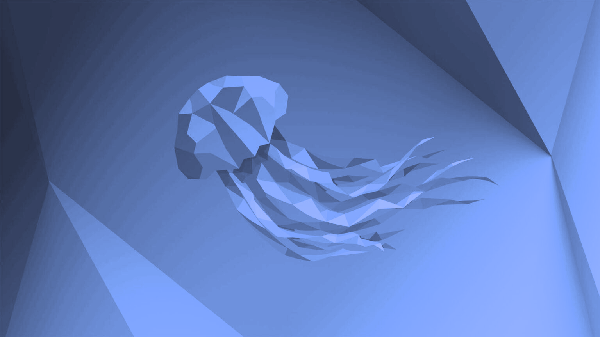
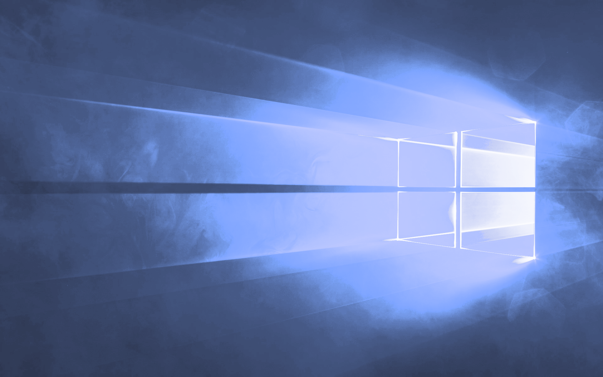

# ChromaHacker

ChromaHacker is a simple palettizer that takes in an image url and produces a version of the image using the specified palette.

To use, simply run 
`pipx install chromahackerweb`
`chromahackerweb`

| Original             | Palettized                  |
| -------------------  | -------------------------  |
|    |    |
|    |    |
|      |      |
|      |      |
|     |     |
|  |  |

See also: , a similar project that was developed at around the same time as chromahacker.

